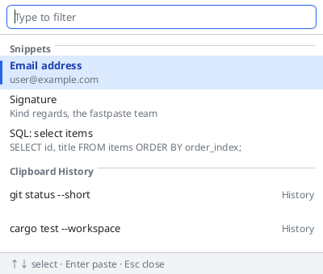
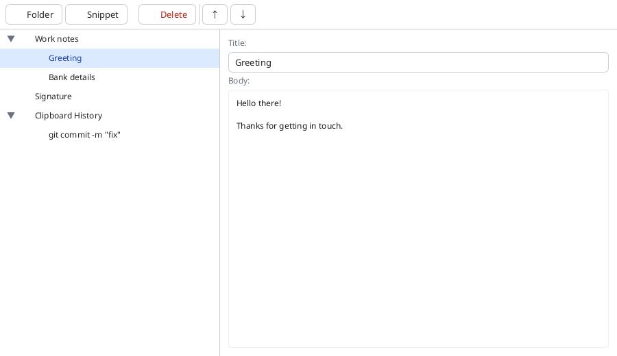
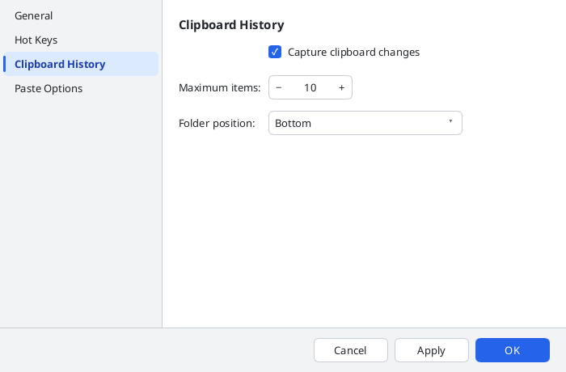

# fastpaste-rs

Clipboard history + snippet manager, written in Rust. One codebase,
built for Linux (Wayland — KDE Plasma 6 / KWin; X11 sessions are not
supported) and for Windows.

Everything the OS is asked for sits behind three traits, and each
platform supplies one implementation:

| | Linux | Windows |
|---|---|---|
| Global hotkeys | `XGrabKey` on the XWayland root window | `RegisterHotKey` |
| Clipboard changes | `wl-clipboard-watch`, arboard polling as fallback | `WM_CLIPBOARDUPDATE` |
| Paste keystroke | `/dev/uinput` | `SendInput` |
| Single instance | abstract unix socket | named mutex |

Everything above `fastpaste-platform` is platform-independent; adding an
OS means adding an implementation there, not a fork.

> **Linux only — the global hotkeys are not truly global.**
> They are grabbed with `XGrabKey` on the XWayland root window, and
> under a Wayland compositor keyboard input only reaches XWayland while
> an X11/XWayland window has focus. With a Wayland-native window focused
> the keystroke never reaches us and goes to that application instead.
>
> On a current Plasma 6 desktop most applications are Wayland-native
> (Chrome and Chromium run that way whenever `--ozone-platform=wayland`
> is in effect), so in practice the shortcuts fire rarely. Making them
> work everywhere needs a different mechanism — the
> `org.freedesktop.portal.GlobalShortcuts` portal, or delegating the
> shortcut to KDE and giving the app an IPC entry point. Until then, the
> tray icon and the main window are the reliable ways in.
>
> **Windows does not have this problem**: `RegisterHotKey` is honoured
> whatever has focus.

## Screenshots

**Selection dialog** — the quick-paste popup. Type to filter, arrow to a
row, Enter pastes. Saved snippets first, clipboard history last, each
group under its own heading.



**Main window** — snippet/folder tree with an editor pane. The clipboard
history appears as a virtual folder alongside the real ones.



**Options** — applied live; a rejected hotkey is reported in the dialog
rather than silently reverted.



## Features

- Main window: snippet/folder tree (CRUD) with an editor pane and toolbar.
  Double-click or Enter on a row pastes it. Deleting a folder — which
  removes its whole subtree, with no undo — asks first
- Selection dialog: keyboard-driven quick-paste popup over the clipboard
  history *and* the snippet library, with type-to-filter and wrapping
  arrow-key navigation. PageUp/PageDown move by a screenful; Home/End
  jump to the ends while the filter box is empty (once you have typed a
  filter they move the text cursor instead)
- Options dialog: general / hotkeys / clipboard-history / paste settings,
  applied live (hotkey changes re-register immediately). A rejected
  hotkey is reported in the dialog and leaves the other changes intact
- Global hotkeys (defaults, configurable): `Ctrl+Alt+V` → selection
  dialog, `Ctrl+Alt+M` → main window; layout-independent
  physical-keycode grabs that work under any keyboard layout. Letters,
  digits, `F1`-`F12`, and named keys (`Space`, `Tab`, `Esc`, `Home`,
  arrows, punctuation…) are accepted, with at least one modifier.
  See the limitation above for when they actually fire, and note that
  KDE's own Klipper may already hold `Ctrl+Alt+V` — the options dialog
  reports that case as "already claimed by another application"
- Clipboard history folder: bounded ring populated by watching the system
  clipboard (wlr-data-control), rendered as a virtual folder in the tree
- Paste via `/dev/uinput` Ctrl+V emulation, with the previous clipboard
  contents restored afterwards
- System tray icon with context menu (Slint native `SystemTrayIcon`)
- Localization: English, Russian, German, Spanish, Simplified Chinese
- Single-instance guard (abstract unix socket, kernel-released on exit)

### Degraded modes

The app starts and stays useful when a piece of the desktop is missing:

| Missing | Effect |
|---|---|
| `/dev/uinput` | Paste puts the payload on the clipboard and leaves it there for a manual Ctrl+V; nothing else changes |
| XWayland / X connection | Global hotkeys do not fire at all (as opposed to firing only over X11 windows — see the limitation at the top). The tray, main window and clipboard history all still work. A connection that drops later is reconnected automatically (up to 5 attempts, 500 ms apart), replaying the registered grabs; past that the hotkeys are inert until the app is restarted |
| System tray | The app quits when the main window is closed, rather than staying resident with no way to reach it |
| A readable `config.toml` | The unreadable file is moved to `config.toml.bak` and defaults are used, rather than failing to start |
| A decodable database row | The row is skipped and logged; the rest of the library still loads |

## Build prerequisites (Linux)

- Rust 1.95+ (rustup recommended)
- `libfontconfig1-dev` (required by Slint):
  ```
  sudo apt install libfontconfig1-dev
  ```
- A Wayland session (KDE Plasma 6 / KWin target) with XWayland available
  (global hotkeys grab via XGrabKey on the XWayland root window).
- For paste via `/dev/uinput`: the user must have read/write access to
  `/dev/uinput`. systemd-logind typically grants this via ACL on login for
  physical sessions; check with `getfacl /dev/uinput`.

## Build

```
cargo build --release
```

## Looking at the UI

The app needs a compositor to run, which makes "does this layout look
right" hard to answer on a build machine. `examples/ui_preview.rs`
renders a window with representative data straight to a pixel buffer via
Slint's software renderer — no display, no compositor:

```
cargo run --example ui_preview -- options 2 out.ppm      # options dialog, page 2
cargo run --example ui_preview -- main   0 out.ppm       # main window
cargo run --example ui_preview -- main   1 out.ppm       # …with the delete confirmation
cargo run --example ui_preview -- select 0 out.ppm       # selection dialog
cargo run --example ui_preview -- select 0 out.ppm en    # …seeded in English
ffmpeg -i out.ppm out.png                                # P6 -> PNG
```

It seeds the longest shipped locale (Russian) by default, because label
clipping and column overflow only show up in the widest strings. Pass
`en` as the fourth argument for English — that is how the screenshots
above are produced. The example
pulls in `slint`'s `software-renderer-systemfonts` feature as a
**dev-dependency**, so the shipped binary is unaffected — but it does
make `cargo test` builds larger.

## Run

```
cargo run --release --bin fastpaste-gui
```

## Workspace crates

Four crates layered bottom-up. `app` imports `data` + `platform`; `gui`
imports all three (it uses `data` types and `platform` hotkey ids directly,
not only through `app`):

### `fastpaste-data` — storage layer

No GUI, no platform code, no I/O beyond SQLite.

- `item.rs` — `Item` / `ItemKind`: the snippet/folder value type that
  crosses all layers (a plain `Clone` struct — it owns `String`s, so not
  `Copy` — with serde + chrono timestamps)
- `database.rs` — `Database`: SQLite CRUD for items and folders. Owns the
  tree invariant: `update` / `move_to_parent` reject a `parent_id` that
  is the item itself, one of its own descendants, or a row that does not
  exist, and every recursive query uses `UNION` so a cycle that reached
  the file some other way still terminates
- `error.rs` — `DataError`, the layer's error enum
- `migrations/` — refinery SQL migrations (`V001__initial_schema.sql`)

### `fastpaste-platform` — Linux platform layer

Everything that touches the OS/desktop environment:

- `hotkey.rs` — `GlobalHotkey` trait + `X11GlobalHotkey` (XGrabKey on the
  XWayland root window, layout-independent physical keycodes), and the
  `OPEN_DIALOG_ID` / `OPEN_MAIN_WINDOW_ID` action ids. The reader thread
  owns the X connection, reconnects when the server goes away, and exits
  cleanly when the backend is dropped. Registering one id never disturbs
  another's live grab, so the two shortcuts can be swapped in one apply
- `clipboard.rs` — `Clipboard` trait + `ArboardClipboard` (read/write via
  data-control) and the `wl-clipboard-watch`-based change watcher with an
  arboard-polling fallback. Own writes are announced by *content* with a
  short TTL (`suppress_text`), so an announced write that never lands —
  or that the polling fallback never observes — expires instead of
  swallowing the user's next real copy
- `uinput.rs` — `EvdevUinputCtrlV` / `NullUinputCtrlV`: `/dev/uinput`
  Ctrl+V emulation, degrading gracefully when the device is unavailable
- `take_once.rs` — `TakeOnceChannel`, a one-shot hand-off primitive used
  by the hotkey event path

### `fastpaste-app` — service layer

Orchestrates data + platform into long-lived services:

- `context.rs` — `AppContext`: composition root bundling every service
  behind `Arc` for the UI controllers, plus the single-instance guard —
  acquired first, before the database is opened or any device claimed.
  `AppContext::new` takes the services directly (the seam the tests use);
  `build` is the production wrapper that resolves XDG paths and opens the
  real backends. `set_settings` owns the "every field applies live"
  contract
- `settings.rs` — `Settings`: typed `config.toml` load/save (confy),
  grouped into general / hotkeys / clipboard-history / paste sections
- `clipboard_history.rs` — `ClipboardHistory`: the bounded ring fed by the
  clipboard watcher, exposed as a virtual folder. `max_items` resizes
  live, trimming from the oldest end
- `paster.rs` — `Paster`: the paste sequence (snapshot → set clipboard →
  delay → Ctrl+V via uinput → restore). Whole sequences are serialised,
  the restore runs even when the keystroke fails, and it is skipped when
  no keystroke was sent at all (so the manual-Ctrl+V fallback has
  something left to paste)
- `paths.rs` — single source of truth for XDG `config_dir` / `data_dir`

### `fastpaste-gui` — Slint frontend (binary `fastpaste-gui`)

- `ui/main_window.slint` — snippet tree + editor + toolbar
- `ui/selection_dialog.slint` — the quick-paste popup
- `ui/options_dialog.slint` — settings dialog
- `ui/tray_icon.slint` — `FastpasteTray` (native `SystemTrayIcon` + menu)
- `ui/widgets.slint` — compact in-house widget set + design tokens
- `ui/translations.slint` — global singleton carrying every UI string
- `src/tree_builder.rs` — flattens `Item` rows + history entries into the
  `TreeItem` list consumed by the TreeView
- `src/i18n.rs` — fluent runtime (embedded `.ftl`, per-locale fallback,
  live language switch)
- `src/main.rs` — controllers wiring Slint callbacks/hotkey events to
  `AppContext`. Editor changes are debounced (~300 ms) into one write
  instead of one per keystroke, and flushed on selection change and on
  close; the editor is seeded from the database rather than the tree
  model, which lags a rename
- `src/ui_state.rs` — thread-local keep-alive slots for the windows and
  the tray. `hide()` drops the only other strong handle, so without these
  a hidden window would be freed and rebuilt on every reopen
- `build.rs` — `slint_build` compilation of the `.slint` files

## Choosing a shortcut

The two defaults differ by the **key** (`V` / `M`), not by a modifier.
That is deliberate. A pair that differs only by Shift is fragile: on many
layouts `Alt+Shift` is the layout switcher, a compositor can claim the
longer combination before it reaches the app, and anything that
normalises Shift away collapses the two into one — which shows up as
"the four-key combination triggers the three-key action". Two different
keys cannot collapse that way.

Note that KDE's own Klipper may already hold `Ctrl+Alt+V`. The options
dialog reports that case as "already claimed by another application"
rather than silently reverting the field.

If a shortcut behaves unexpectedly, ask the app what it actually
received:

```
RUST_LOG=fastpaste_platform=debug cargo run --bin fastpaste-gui
```

Every registration is logged with its resolved keycode and modifier
mask, and every fire is logged with the id that claimed it plus the raw
modifier state that arrived. If the state that arrives does not match
the mask that was registered, the compositor or the keymap changed it on
the way.

## Data & configuration

| What | Path |
|---|---|
| Settings | `~/.config/fastpaste/config.toml` |
| Database | `~/.local/share/fastpaste/fastpaste.sqlite` |

The config file is created on first save with these defaults. Missing
fields fall back to their defaults, so a config written by an older version
keeps loading after upgrades:

```toml
[general]
language = "system"          # "system" follows the OS locale; or a BCP-47 tag

[hotkeys]
open_dialog = "Ctrl+Alt+V"
open_main_window = "Ctrl+Alt+M"

[clipboard_history]
enabled = true
max_items = 10               # clamped to 1..=500
position = "bottom"          # "top" | "bottom"

[paste]
delay_ms = 70                # pause between clipboard set and Ctrl+V; clamped to 0..=5000
restore_clipboard = true     # put the previous clipboard back after paste
```

Numeric values are clamped to the ranges above on load, so a hand-edited
typo cannot turn into a failed allocation or a wedged paste worker. A
file that cannot be parsed at all is moved aside to `config.toml.bak`
and defaults are used — the app never fails to start over its config.

## Dependencies

Versions used by more than one crate are pinned in the workspace root
`Cargo.toml` (`[workspace.dependencies]`) and pulled in via
`dependency.workspace = true`. Single-consumer dependencies
(`rusqlite`, `refinery`, `directories`, `confy`, `single-instance`, …)
are pinned in the crate that owns them.

| Crate | Used by | Purpose |
|---|---|---|
| `slint` | gui | Declarative UI toolkit: main window, dialogs, system tray |
| `slint-tree-view` | gui | Slint TreeView component for the snippet tree |
| `slint-build` | gui (build) | Compiles `.slint` files at build time; `experimental-module-builds` feature resolves `import { TreeView } from "@TreeView"` against the library crate |
| `fluent-templates` | gui | Fluent static loader: embeds the `.ftl` files at compile time, per-key fallback chain to English |
| `sys-locale` | gui | Resolves the `"system"` language setting from the OS locale |
| `fluent-syntax` | gui (dev) | Parses `.ftl` sources in the key-parity test |
| `tracing` | platform, app, gui | Structured logging |
| `tracing-subscriber` | gui | Log output with `RUST_LOG` env-filter support |
| `anyhow` | app, gui | Ergonomic error handling at the service/main level |
| `thiserror` | data, platform, app | Derive error enums for each layer's error type |
| `rusqlite` (features `bundled`, `chrono`) | data | SQLite driver; `bundled` builds the C library in, `chrono` gives native `DateTime<Utc>` ↔ TEXT conversion |
| `refinery` | data | SQL migrations (`fastpaste-data/migrations/`) |
| `serde` | data, app | Serialization: `Item` rows and `config.toml` |
| `chrono` | data, app, gui (dev) | Timestamps: RFC 3339 in the DB, history entry times |
| `directories` | app | XDG `data_dir`/`config_dir` resolution |
| `confy` | app | TOML config load/save |
| `single-instance` | app | Single-instance guard: abstract unix socket keyed on the data dir (no lock file, kernel-released on exit) |
| `arboard` (feature `wayland-data-control`) | platform | Clipboard read/write (`set_text`/`text`): native data-control protocol on Wayland — the same transport as the watcher — with arboard's X11 backend as fallback when the compositor offers no data-control |
| `wl-clipboard-watch` | platform | Event-driven clipboard change detection (ext/wlr-data-control); the platform layer falls back to arboard polling when neither protocol is available |
| `evdev` | platform | `/dev/uinput` virtual keyboard to emit Ctrl+V; `KeyCode: FromStr` also resolves hotkey key names to physical kernel keycodes |
| `x11rb` | platform | XGrabKey global hotkeys on XWayland — physical keycodes, layout-independent (the `global-hotkey` crate resolves keysyms via the core keymap and fails under Cyrillic layouts); `GetModifierMapping` resolves real Alt/NumLock/Super modifier bits |
| `libc` | platform | `poll(2)` for the hotkey reader's blocking loop (wakes on X traffic or a wake-pipe byte); already a transitive dep of x11rb |
| `tempfile` | data, app (dev) | Temp directories in tests |
| `serde_json` | data (dev) | Serde round-trip asserts in tests (enum `#[serde(...)]` attributes) |

Version constraints worth knowing when upgrading:

- `slint`, `slint-build`, and `slint-tree-view` are all pinned in the
  workspace root `[workspace.dependencies]` and must stay on compatible
  versions — the TreeView library exports `.slint` types compiled against
  the same Slint compiler.
- `fluent-templates` 0.15 (fluent-bundle 0.16, fluent-syntax 0.12,
  unic-langid 0.9) and the dev-only `fluent-syntax` 0.12 share the same
  `unic-langid-impl` major; mixing older majors conflicts.
- `wl-clipboard-rs` (pulled in transitively by arboard's
  `wayland-data-control` feature) exposes **no watch API** in any
  published version — its watch surface lives only in the separate
  `wl-clipboard-rs-tools` binary (verified against docs.rs, 2026-08).
  Clipboard *watching* therefore stays on `wl-clipboard-watch`; don't
  "simplify" it away in favor of the transitive `wl-clipboard-rs`.

## License

MIT — see [LICENSE](LICENSE).
